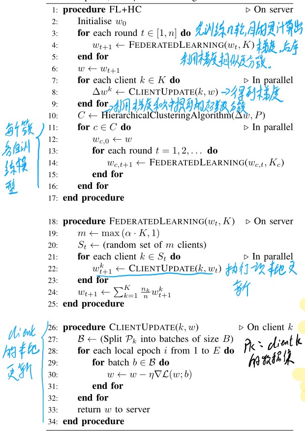

# Client Selection for Federated Learning with Heterogeneous Resources in Mobile Edge

## 1.解决问题

在传统联邦学习中，client本地模型的训练分为本地更新update和模型上传upload两个部分。但由于client之间存在诸如数据量大小、计算能力、通信信道状况等异质性，使得整体的模型训练时间会被延长，整个训练过程可能变得很低效。

## 2.如何解决

作者基于Mobile edge computing(MEC)，提出了一种名为FedCS的算法。目的在于解决联邦学习过程中选择符合要求client参与训练的问题。即(client selection problem)。

该算法在工作的过程中对client的模型下载，模型更新，模型上传步骤都设置了deadline。而后，MEC operator依据这些deadline从client中选择符合要求的client，并使服务器可以在有限的时间框架内聚合尽可能多的客户端更新，从而使整个训练过程高效，减少了训练ML模型所需的时间。

## 3.公式化描述

令

$S=[k_1,k_2,...,k_i,...,k_{|S|}]$表示被选中的client集合。$k_i$表示第$i$个client。

$t_k^{UD}$表示第k个client更新模型的时间

$t_k^{UL}$表示第k个client上传模型的时间

$\Theta_{i}:=\left\{\begin{array}{ll}0 & \text { if } i=0 \\ T_{i}^{\mathrm{UD}}+T_{i}^{\mathrm{UL}} & \text { otherwise }\end{array}\right.$

$\Theta_i$表示从0到第i个client工作完成消耗的时间

$T_i^{UD}=\sum_{j=1}^i \max \{ 0,t_{k_j}^{UD}-\Theta_{j-1} \}$(前一个进行更新时，后一个也可以进行)

$T_i^{UL}=\sum_{j=1}^i t_{k_j}^{UL}$

目标：
$$
\begin{array}{ll}
\max _{\mathbb{S}} & |\mathbb{S}| \\
\text { s.t. } & T_{\text {round }} \geq T_{\mathrm{cs}}+T_{\mathrm{S}}^{\mathrm{d}}+\Theta_{|\mathbb{S}|}+T_{\mathrm{agg}}
\end{array}
$$
参数$T_{rount}$非常重要。若太小，则可以选中的client数量较少。若太大，则在$T_{final}$范围内可做的更新就会变少。

算法：

## 4.思考

1. 在client告知信息的过程中时间和通信的消耗。
2. 会不会导致一些client一直不能参与导致产生bias。（参考Advance and open problem...论文中的公平性问题）

# Client-Edge-Cloud Hierarchical Federated Learning

## 1.解决问题

在FL不同的部署场景下，云服务器(cloud server)运算速度较快，可以处理大量的数据。但由于距离client较远，因此通信时延较大，最终导致有限时间内模型训练不充分。边缘服务器(edge server)距离client较近，拥有较好的通信效率，但由于计算能力有限，其只能连接有限数量的client，最终导致不可避免的训练效果损失。

## 2.如何解决

作者基于两种系统的优点，提出了三层架构的FL系统。即client->edge server->cloud server。在edge server端进行模型的部分聚合。而后再上传到cloud server进行整个模型的聚合。

## 3.公式化描述

在pdf中有详细的阅读笔记，参考对应论文旁注。

# Asymmetrical Vertical Federated Learning

## 1.解决问题

在纵向联邦学习中，我们通常直接假设不同参与方的ID是已经对齐的。因此没有考虑过与用户数据ID相关的隐私保护。为了减轻用户对ID隐私的担忧，本文提出“非对称垂直联邦学习”。在非对称垂直联邦学习系统中，采用标准的私有集交叉协议实现非对称ID对齐。

“在实际应用中，参与者通常是处于竞争关系中的公司或机构，一个公司的许多客户是另一个公司潜在的广告目标。因此，一方面，参与者不允许公开他们的示例id。另一方面,有不对称联合会在现实生活中,参与者的一个子集的小公司,并有很强的身份隐私保护的需求,而另一个是大公司不关心ID的隐私,因为他们的客人几乎都是公民社会。这种不平衡的设置需要一个垂直的联邦学习系统来区分联邦的弱项和强项，并考虑到他们具体的隐私保护需求。”

## 2.主要贡献

1. 正式提出和表示了非对称纵向联邦学习。（对应论文 section 2）
2. 提出了一种适应私有集对齐的协议。

# Enhancing Privacy via Hierarchical Federated Learning

## 1. 解决问题

本文是一篇关于Hierarchical Federated Learning相比于传统联邦学习对解决安全性问题的一篇分析文章。

在传统的中心化联邦学习中，整个训练过程过于依赖中心的server。这给模型的安全性带来了极大的挑战。从诸多层面都可对中心化的模型进行攻击。而在分层联邦学习中，采用分层机制，一方面引入多层结构，通过在每一层采取不同的保护举措，整体达到了模型安全性和准确性的trade-off。另一方面通过每一层的服务器，都可将client划分成许多不同的group，减小了对整体模型被攻击的危险。

本文从**Centralized control**，**Limited verifiability**，**Constrained defenses**三个层面说明传统FL的安全性漏洞和HFL针对这些问题的解决。

## 2. 详细内容

### 2.1 Centralized control

FL中的服务器扮演中心协调者的角色，执行以下核心功能：

1. 对用户进行抽样，即选择哪些用户参与训练过程
2. 广播模型和训练算法
3. 聚合模型更新
4. 广播更新后的全局模型

#### 2.1.1 传统FL的问题

基于FL中server的核心功能，尽管这样的设置限制了用户的计算成本，但它将所有控件放在单一方——服务器上。因此，服务器可能会出现性能瓶颈和单点故障。此外，从隐私的角度来看，将这些功能集中在服务器上会使用户对这些处理过程的控制受到限制或完全没有控制。因此，client只能选择相信server去做FL总体模型训练的全过程以及保护他们的模型更新。这就导致如果服务器是恶意的，或者一个对手要破坏服务器，就会对用户进行各种攻击。

#### 2.1.2 HFL如何解决

HFL允许将不同的FL功能分布到整个层次结构中的组服务器和用户，这有助于克服通常在FL中发现的性能瓶颈和单点故障。这是因为组服务器可以在层次结构中使用本地聚合模型，直到它们在顶部的根服务器上聚合为止。

接下来，我们为每一个的替代位置介绍FL功能。

1. 对用户进行抽样，即选择哪些用户参与训练过程

   在传统FL中，只有server可以执行用户选择。这就导致其权力太大，若server是恶意的，那么整个模型的训练就会崩溃。
   在HFL中，通过分层机制，每一层的组服务器都可以执行模型选择功能。通过权力划分，增强每一层的信任和责任基础，提高了整体模型的安全性。

2. 广播模型和训练算法
   恶意的训练算法会泄露有关训练数据的信息。
   在FL中，通过划分用户训练子模型会将他们的数据信息透露给服务器。
   在HFL中，将模型划分为子模型可以在不同的阶段通过层进行，这样上层不知道下层如何或者是否进一步划分模型。因此，组服务器看作一个保护层，在将算法推送给用户之前，在这里对算法进行检查和验证。

3. 聚合模型更新
   在传统FL中，模型的聚合更新只能发生在中心服务器。

   在HFL中，根据层次结构中的层数，会发生多个级别的聚合。这样，只有最底层的组服务其会接收到用户的个性化更新。而高层只是简单的聚合组服务器的模型。这样，上层的安全聚合需求减少了，这可以解释为性能改进。此外，级联聚合过程有助于保护用户身份不受更高层服务器的影响。

4. 广播更新后的全局模型
   FL中的一些隐私攻击需要向目标用户分发一个中毒模型。FL中用户级的平面拓扑允许这种类型的攻击容易访问。
   HFL提供了通过多层更有效地控制模型传播的可能性。如果在层次结构中检测到中毒模型，组服务器可以避免将其推给用户。

### 2.2 Limited verifiability

在FL中，服务器和用户在本地执行数项计算并相互共享计算结果。用户共享他们的更新，而服务器共享聚合的模型。为了允许服务器和用户互相证明他们正确地执行预期的计算并共享合法的输出，需要对计算进行验证。

#### 2.2.1 传统FL的问题

1. 所提供的证明类型是有限的
2. 验证所需的时间通常随着用户数量呈指数级增长

#### 2.2.2 HFL如何解决

在HFL中，验证用户的更新可以由相应的组服务器执行。将用户分组到比较小的组中可以减少组服务器上的计算开销，并使验证方法的部署更加可行。

### 2.3 Constrained defenses

虽然FL提供了用户隐私保护的改进措施，但它也为恶意服务器和恶意用户的攻击敞开了大门。在这项工作中，我们关注隐私攻击，攻击者的目标是推断用户信息。这些攻击有两种模式:被动和主动。

#### 2.3.1 传统FL的问题

FL中的大多数防御手段都伴随着较低的模型精度、相当大的计算开销，或两者兼之。

#### 2.3.2 HFL如何解决

HFL在层次结构的不同部分应用不同的方法，这样就不会使所有的用户在准确性上遭受严重损失，也不必执行昂贵的计算。

由于HFL的上层流程只聚合模型，而不是单个用户的更新，因此在这些层中可以减少甚至消除安全聚合的必要性。这可以提高性能，并允许应用异常检测方法。在从特定的组服务器检测恶意模型之后，可以将该服务器排除在进一步的聚合轮中，同时在层次结构的其余部分维持训练进程的正常运行。

## 3. 个人思考

我认为，HFL之所以可以解决传统FL中遇到的大多数问题，关键在于HFL使用了层次化结构的思想。通过划分层，每一层使用基于自己的特点使用不同的策略，不必为了顾虑大环境而做出牺牲。同时每一个组服务器下都相当于一个自治系统，通过分而治之，将风险局限在一个小的范围内。

# FedCD: Improving Performance in non-IID Federated Learning

## 1.解决问题

在具有数据异质性的联邦学习问题中，使用一个全局模型往往不能满足所有client的需求。导致其对某些client是准确的，有些client是不准确的。甚至，不同分布的数据会使全局模型向不同的方向更新，导致全局模型执行FedAvg后在大多数client上表现都不好。

## 2.如何解决

既然单一global模型不能很好地fit所有client，那么训练多个global模型。

作者提出了一种新的算法`FedCD`（联邦克隆-删除模型）：在指定的里程碑处迭代克隆全局模型，自适应更新全局模型的获得高分的子集，删除性能较差的模型。通过维护多个全局模型，设备可以优先更新在其本地数据上表现良好的模型，从而自选择具有相似数据的组。这允许更快的收敛和更高的精度。

## 3.算法流程

算法1描述了FedCD，它以最小的通信和收敛后的设备上内存开销来处理非iid联邦学习。FedCD会在里程碑式的回合中克隆高性能的型号，并在更新每台设备的型号分数时删除性能较差的型号。

核心idea：每个client都使用本地数据训练global发下来的一系列模型，将其更新参数和评分都发给server。server对**每个**模型进行聚合，**打分高的更新**占的比例大。然后，将这些全局模型重新部署到适当的边缘设备上，并删除得分较低的模型。

# Federated learning with hierarchical clustering of local updates to improve training on non-IID data

## 1.解决问题

与上一篇出发点类似，都是为了解决存在数据异质性问题时单一的全局模型无法很好地满足所有client准确性的问题。

## 2.怎么解决

由于传统FL中单一模型很难同时满足所有client的需求，针对具有类似数据分布的客户组的多个模型可能是首选。

通常对于单一模型不能解决的问题，我们会采用分簇的思想训练多模型。但大多数分簇算法的问题是需要提前设定共有多少簇，这在现实中应用时往往是不可能的。

在本篇paper中，作者也是采用了多模型的思想。作者使用了`Hierarchical Clustering`这种分簇方法，将具有**相似目标**的client划分成一簇，而后让一簇内的client训练一个专有的模型。

### 2.1 Hierarchical Clustering

使用`Hierarchical clustering`很好地解决了“一些自动确定聚类数量的聚类方法没有将边远样本分给一个集群，只是将其标记为噪声”这一问题。

使用`Hierarchical clustering`需要解决两个超参数：

1. 如何衡量两个簇之间的距离
   常用的有曼哈顿距离，欧几里得距离和余弦距离。
2. 确定两个簇有多相似的连杆机制
   单链接决定距离的基础上最相似的样本对跨两个聚类。完整链接基于两个簇中最不相似的样本对来决定距离。平均链接平均每一簇内的样本，并基于这些平均值比较距离。

### 2.2 如何分簇

本文要通过client目标的相似程度进行分簇，但client的原生输入不能被直接进行比较。只能通过观察每一轮模型梯度更新的方向来判别client相似度。

## 3. 算法流程

# An Efficient Framework for Clustered Federated Learning

## 1. 解决问题

仍然是解决存在non-iid问题时，单一模型不能很好的满足所有用户的需求。

## 2. 怎么解决

server端设有多个全局模型。将client划分成簇，不同簇训练不同的全局模型，相同簇内共同训练一个模型。

## 3. 解决问题过程中的问题

将client划分为哪一个簇属于“分布式环境下具有潜在变量的联邦估计问题”。这是一个经典的非凸问题。解决此类问题的方法时常用的方法有“ 期望最大化( Expectation Maximization)”和"交替最小化( Alternating Minimization)"。本文采用交替最小化的方法，在迭代的过程中交替最小化loss同时评估模型的身份。

## 4. 算法思路

**需要注意的几个地方：**

1. client通过loss来评估自己属于哪一个全局模型。对应公式$j=argmax(F(\theta_1),F(\theta_2))$
2. client在确定当前属于哪一个簇之后，就更新对应簇的参数，并将其发送至server
3. client所在的簇不是一成不变的。在每一个时间点t都先评估自己所属的cluster。

## 5. 存在问题

像许多分簇问题一样，本文算法要求能够提前知道联邦模型被分成了多少簇。即，在初始状态就需确定有多少个全局模型。

# Federated Learning with Personalization Layers

## 1. 解决问题

仍然是联邦学习下数据non-iid的问题

## 2. 怎么解决

参考了`Multi-task learning`的思想，设计了base+personalization的模型。不同client共同训练神经网络的底层模型，在模型的高层，每个client有自己独特的layer。